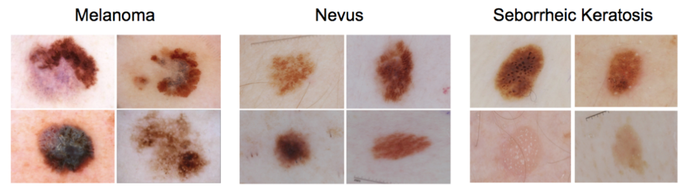

# Skin Classification: A Comparative Analysis of Machine Learning and Deep Learning Approaches

**Authors:** Xavier Beltran Urbano, Clara Lisazo and Luisana Álvarez Monsalve

## Dataset

For the development of this approach, the **ISIC 2017 Dataset** has been used, which contains 2000 images. TEach image in the dataset is classified as melanoma, seborrheic keratosis, or benign nevus.

<figure align="center">
  
  <figcaption>Figure 1. Label distribution of ISIC 2017 challenge.</figcaption>
</figure>

## Methodology

In the study, traditional Machine Learning (ML) and modern Deep Learning (DL) techniques were employed to conduct a comparative analysis in skin classification tasks. The methodology involved several stages for both approaches.

In the Machine Learning approach, the initial phase included preprocessing of images and feature extraction, where a combination of image processing techniques and transfer learning were used. The extracted features underwent dimensionality reduction using Principal Component Analysis (PCA). Various classifiers, including Support Vector Machine (SVM), Random Forest, and K-Nearest Neighbors (KNN), were then implemented. The study employed a 10-fold cross-validation strategy to validate the models and used a one-versus-all technique for multi-class classification to train the classifiers.

  

Figure 2. Machine learning approach diagram.

For the Deep Learning approach, we utilized the default preprocessing functions of Keras, ensuring consistency with the methods used during the training of the pretrained networks. To counteract the effects of an unbalanced dataset, data augmentation techniques were applied, including random transformations like rotations and flips on images of the minority classes. In the model creation and compilation stage, several pretrained networks such as InceptionResnetV2 and VGG16 were evaluated. These networks were modified at the top layers to suit the classification task at hand. The models were compiled using the Adam optimizer, and categorical cross-entropy was selected as the loss function, with accuracy as the evaluation metric. During training, we established specific parameters for epochs and class weights, and implemented an Early Stopping callback to reduce the risk of overfitting.

<figure align="center">
  
  <figcaption>Figure 3. VGG16 model’s architecture.</figcaption>
</figure>

## Results:

The Machine Learning approach achieved a commendable level of success, with a maximum balanced accuracy of 68%. The most promising results within this category emanated from the Logistic Regression and SVM classifiers. However, the Deep Learning models demonstrated superior performance, with the InceptionResnetV2 architecture achieving a maximum balanced accuracy of 72%. Other Deep Learning models, including VGG16, VGG19, and various ResNet models, also delivered competitive performance, underscoring the potency of deep neural networks in image classification tasks.

## Conclusion:

The research provided a comprehensive comparison between traditional Machine Learning classifiers and Deep Learning methods in the context of skin classification. It was found that Deep Learning models surpassed their Machine Learning counterparts, primarily attributed to their end-to-end learning capability, which simultaneously optimizes feature extraction and classification. This highlights the efficacy of Deep Learning in deciphering complex patterns within medical imaging, although the study also emphasizes the need for further enhancements, considering the critical nature of clinical diagnostics and the potential ramifications of misdiagnoses.